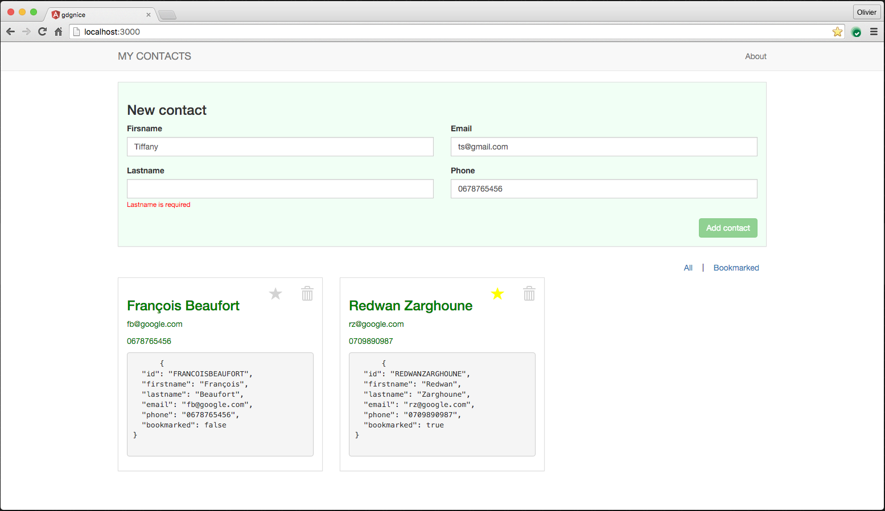

# Contact manager to demonstrate Angular2

Very simple contact manager used for GDG Nice meetup on January 2015.

The code and functionalities can be improved ^^.

## Angular usages
The app demonstrates the basics of Angular2 :
* Component
* Pipe (use and create)
* Router
* form (and basic validation)
* Event (use and create)
* Dependency injection

## About
This project was created using the [ModernWebDev Yeoman Generator](https://github.com/dsebastien/modernWebDevGenerator) by [dSebastien](https://twitter.com/dSebastien).

### How to build
First, make sure that you have installed the required global npm packages: `npm install gulp --global --no-optional`.

Also install some typescript dependencies :
`npm install typescript -g; npm install tsd -g`

Next, you also need to install the project dependencies using `npm run setup`.

Then run `npm run serve` to run the project and go to [http://localhost:3000](http://localhost:3000, "http://localhost:3000")
